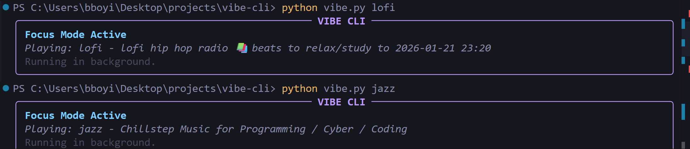

# Vibe CLI 🎵

A lightweight, terminal-based background audio player for focus and relaxation. Tunes into live streams (Lofi Girl, Synthwave, etc.) without the distraction of a browser window.


## Features

- **Background Audio**: Plays music in the background using `ffplay` (detached process).
- **Distraction Free**: No video, no browser, just vibes.
- **Rich UI**: Stylish terminal output.
- **Auto-Cleanup**: Automatically stops the previous track when you switch vibes.
- **Global Control**: Run `vibe` from anywhere (on Windows).

## Prerequisites

1.  **Python 3.8+**
2.  **FFmpeg** (specifically `ffplay`):
    - Windows: `winget install --id=Gyan.FFmpeg -e`
    - Mac: `brew install ffmpeg`
    - Linux: `sudo apt install ffmpeg`

## Installation

1.  Clone the repository:
    ```bash
    git clone https://github.com/OyinBankole-Brown/vibe-cli.git
    cd vibe-cli
    ```

2.  Install Python dependencies:
    ```bash
    pip install -r requirements.txt
    ```

## Usage

Run the script directly:

```bash
python vibe.py [vibe_name]
```

Stop playback:

```bash
python vibe.py --stop
```

### Available Vibes

- `lofi` (Default)
- `synthwave`
- `rain`
- `jazz`
- `nature`

## Global Setup (Windows)

To run `vibe` from any terminal:

1.  Add the project directory to your **System PATH**.
2.  Now you can simply type:
    ```cmd
    vibe synthwave
    vibe stop
    ```

## License

MIT
